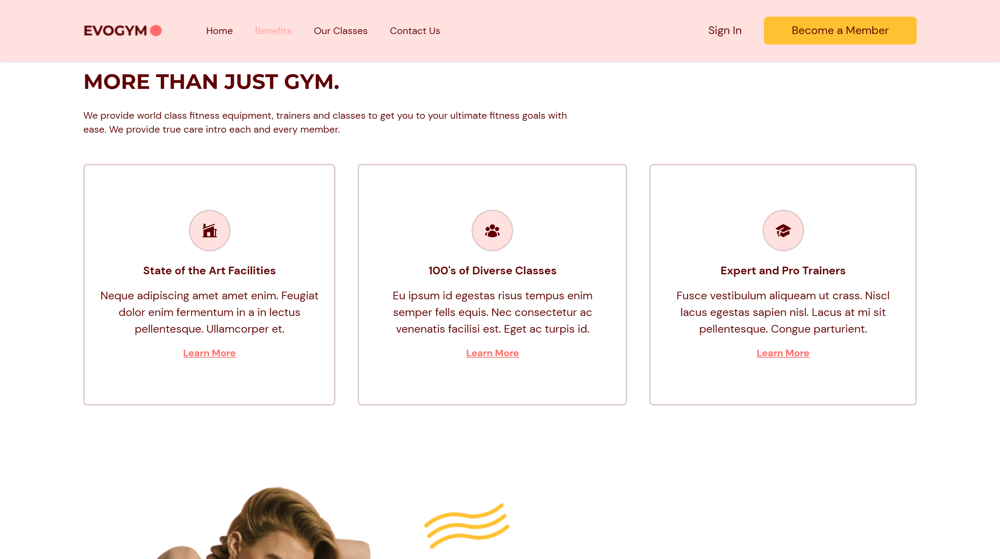

# 🏋️‍♀️ Typescript Fitness App.

---

## 🚀 Ejemplo en vivo
- [Deploy en Render](https://evogym.onrender.com/)

---

## Tecnologías 🛠

---

## Vista previa del proyecto
Si quieres hechas un vistazo al proyecto, te recomiendo:

---

## Autor ✒️
Facundo Luna

* [facundolunaok@gmail.com](facundolunaok@gmail.com)
* [LinkedIn](https://www.linkedin.com/in/facundoluna/)
* [Twitter](https://twitter.com/FacuFrontend)